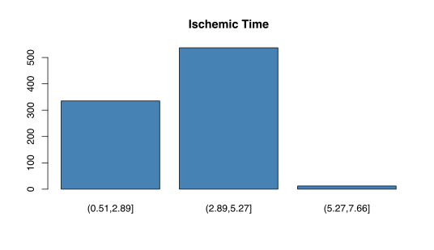
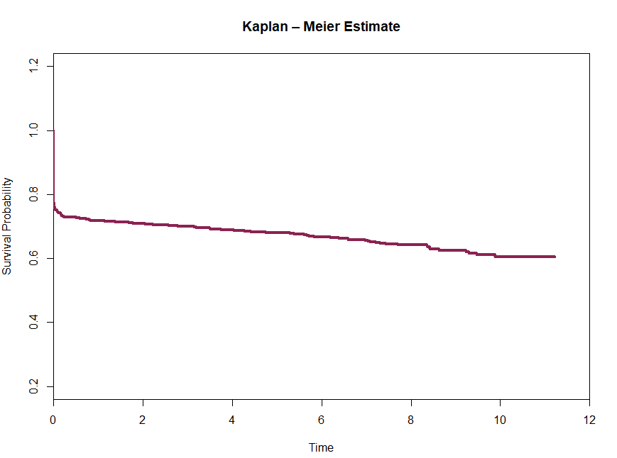

# Survival analysis based on ischemic time

The analysis is based on **heart transplanation** data. This study gives the potential to extract significant information about the survival probability depending on ischemic time. So, a variation in ischemic time can influence the adaptation of the transplant in years; and what is the survival probabilty if the ischemic time is 1 hour;

> Info: **Ischemic time** is the time that an organ is outside the body when the heart is not beating or supplied with O2 by the coronary arteries.

# Installation & run project
These are the packages used in the analysis:
```R
library(survminer)
library(survival)
```

```bash
git clone https://github.com/askandali/heart-transplant-analysis.git
cd heart-transplant-analysis

install.packages(install.packages("survival", "survminer"))
Rscript bio.R
```
## Data

The file **SurvData6.txt** consists of 884 observations and 3 variables. These variables give us the following information about a patient:

- Survival time
- Censor
- Ischemic time

The ischemic time (IT) in a barplot: In most of the cases the ischemic time is between 2.87 and 5.27 hours.



## Kaplan - Meier curve

> In the Kaplan - Meier curve it is obvious that at the survival probability instantly reduces to about 80% without the passing of the time. This shows that there are cases that the tranplant didn't adapt in the patient organism from the first time.



## Cox Model

>The **Cox proportional-hazards model** is essentially a **regression model** commonly used statistical in medical research for investigating the association between the survival time of patients and one or more predictor variables.

```
sCox1 <- coxph(s ~ IT,data=b)
summary(sCox1)
```


## Results

 1. By applying the Cox model, the ischemic time is not statistically significant and doesn't influence a lot the survival time.

2. If the ischemic time is 1 hour, the average survival probability is 77%.
